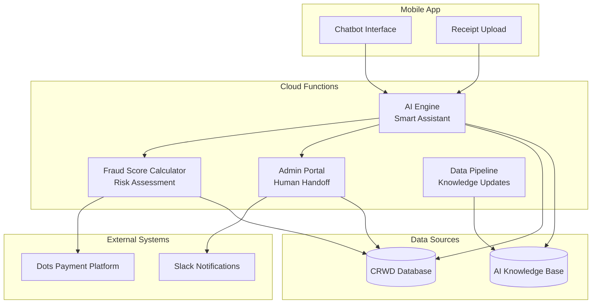
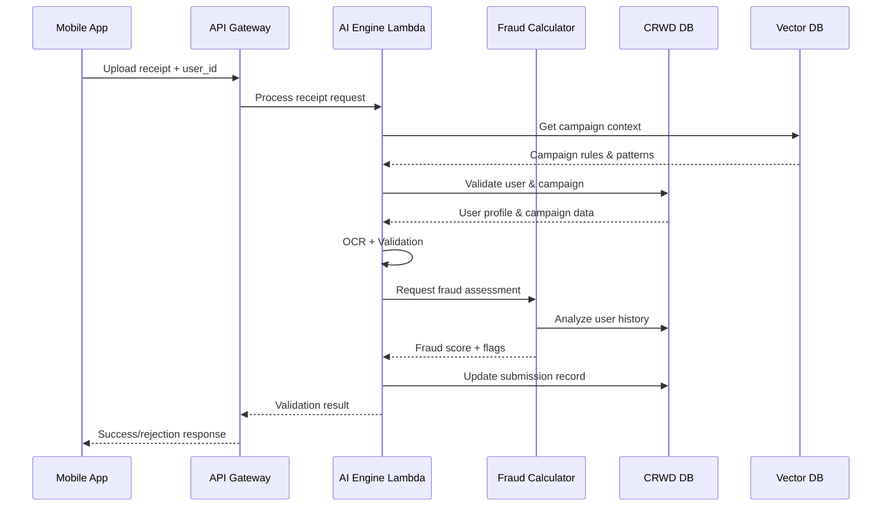
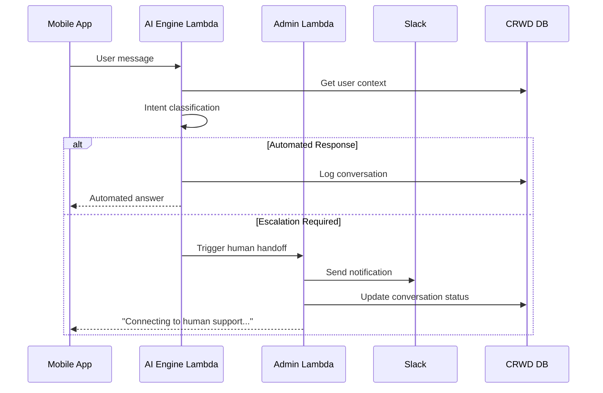

# CRWD Intelligence System - High-Level Design Document

## System Overview

The CRWD Intelligence System transforms how CRWD handles receipt verification, fraud detection, and customer support through four specialized cloud functions working together seamlessly.

## AI Engine: The Digital Assistant Story

Imagine the AI Engine as a highly skilled digital assistant who works just like a human support representative, but with superpowers:

**The Assistant's Day**: When a user submits a receipt or asks a question, our AI Assistant "wakes up" and immediately gets to work. Like a human worker, it:

1. **Gathers Information**: Reviews the user's history, active campaigns, and relevant company policies from the database
2. **Analyzes the Request**: Uses its expertise to understand what the user needs (receipt verification, support question, fraud check)
3. **Makes Decisions**: Applies business rules and intelligence to determine the right response
4. **Takes Action**: Processes the request, updates records, and responds to the user
5. **Goes Away**: Once the task is complete, the assistant disappears until needed again

**Key Characteristics**:

- **One Request, One Focus**: Handles exactly one task at a time with complete attention
- **Data-Driven**: Always consults the most current information before making decisions
- **Intelligent Routing**: Knows when to handle something itself vs. when to call for human backup
- **Memory**: Remembers conversation context within a session but doesn't stay "awake" between requests
- **Scalable**: Multiple assistants can work simultaneously when demand is high

## Core System Components

### 1. AI Engine - The Smart Assistant

**Primary Role**: Acts as the central intelligence that understands and processes all user interactions

**Key Capabilities**:

- **Receipt Verification**: Reads receipt images, extracts purchase details, validates against campaign rules
- **Customer Support**: Understands user questions and provides instant, personalized responses  
- **Fraud Detection**: Identifies suspicious patterns like duplicate receipts or unusual submission behaviors
- **Smart Routing**: Determines when to handle requests automatically vs. escalating to human support

**GIVEN** any user request (receipt upload or support question)
**WHEN** the AI Engine processes it
**THEN** the system delivers accurate, contextual responses based on current data and business rules

### 2. Fraud Score Calculator - Risk Assessment Engine

**Primary Role**: Continuously evaluates and scores user risk to prevent fraudulent activities

**Risk Assessment Factors**:

- User profile quality and completeness
- Historical submission patterns and success rates
- Transaction timing and frequency analysis
- Cross-reference validation with payment data

**GIVEN** user activity or new submission
**WHEN** fraud assessment runs
**THEN** system generates risk score (0-100) and flags high-risk users for additional review

### 3. Admin Portal - Human Handoff Manager

**Primary Role**: Enables seamless transition from automated to human support when needed

**Core Functions**:

- **Monitoring Dashboard**: Real-time view of all submissions, fraud scores, and system activity
- **Escalation Management**: Automatically routes complex cases to appropriate human support via Slack
- **Override Capabilities**: Allows human administrators to override system decisions when warranted

**GIVEN** complex user issues or system limitations
**WHEN** escalation criteria are met
**THEN** human support receives complete context and can take over seamlessly

### 4. Data Pipeline - Knowledge Updater

**Primary Role**: Keeps the AI Engine current with latest campaigns, policies, and knowledge

**Update Sources**:

- Campaign rules and product catalogs from CRWD database
- FAQ updates and support knowledge base changes
- Historical patterns for improved fraud detection
- Payment platform data for user verification

**GIVEN** changes to business rules or knowledge base
**WHEN** pipeline processes updates
**THEN** AI Engine immediately has access to current information for decision-making

## Data Storage Strategy

### Enhanced CRWD Database

The system extends the existing CRWD database with additional collections to support intelligence operations:

**New Data Collections**:

- **Fraud Scores**: Maintains risk assessment data for each user with detailed scoring factors
- **Conversation History**: Stores all customer support interactions for context and escalation
- **AI Processing Logs**: Tracks system decisions and performance for audit and improvement

### AI Knowledge Base

A specialized vector database stores campaign information, FAQs, and user patterns in a format optimized for AI understanding and quick retrieval.

## System Integration Points

**Mobile App Integration**: Users interact through an embedded chatbot component for seamless support and receipt submission

**CRWD Database Connection**: Leverages existing user profiles, campaign data, and payment records for comprehensive context

**Dots Payment Platform**: Real-time access to transaction history and payout information for enhanced fraud detection

**Slack Integration**: Automatic notifications to support teams when human intervention is required

## Data Flow Architecture

### Receipt Processing Flow:

### Customer Support Flow:

## Business Value & User Experience

### For CRWD Operations Team

- **Automated Processing**: 80% of receipts validated automatically, reducing manual review workload
- **Fraud Prevention**: Early detection of suspicious patterns prevents revenue loss
- **Comprehensive Dashboard**: Single view of all transaction activity with risk indicators

### For Customer Support Team

- **Instant Responses**: Common questions answered immediately without human intervention
- **Smart Escalation**: Complex issues routed with full context for efficient resolution
- **Reduced Workload**: Focus on high-value customer interactions rather than routine inquiries

### For CRWD Members

- **Faster Approvals**: Receipt validation completed in seconds instead of hours
- **24/7 Support**: Get help anytime through intelligent chatbot
- **Transparent Process**: Clear communication about submission status and requirements

## Performance & Reliability Standards

### Response Time Expectations

- **Receipt Processing**: Complete validation within 30 seconds
- **Customer Support**: Instant responses for common questions
- **Fraud Assessment**: Risk scoring completed within 5 seconds
- **Admin Dashboard**: Real-time data updates with 2-second load times

### Error Handling Philosophy

- **Graceful Degradation**: System continues operating even if individual components fail
- **Human Backup**: Automatic escalation ensures no user requests are lost
- **Audit Trail**: Complete logging of all decisions for compliance and improvement
- **Recovery Procedures**: Quick restoration capabilities for all critical functions

## Success Metrics

### Operational Efficiency

- Reduce manual receipt review by 80%
- Decrease fraud losses by 60%
- Cut customer support response time by 90%
- Improve user satisfaction scores by 40%

### System Performance

- 99.9% system uptime during business hours
- Sub-30-second processing for all receipt submissions
- Zero data loss during system failures
- Complete audit trail for all transactions

This intelligent system transforms CRWD operations from manual processes to automated, scalable workflows while maintaining the human touch where it matters most.